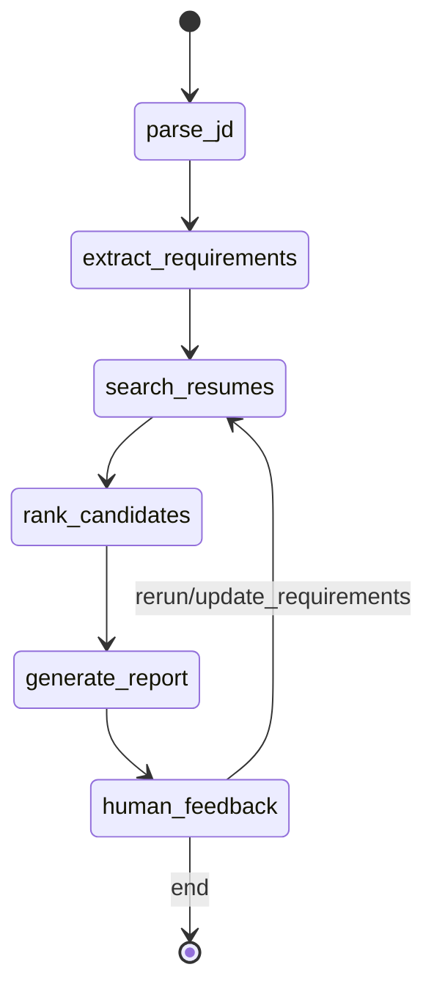

# AI Hiring Assistant (LangGraph)

Production-style AI Hiring Assistant for hiring managers that parses job descriptions, extracts requirements, retrieves and ranks candidates via RAG, supports conversational queries, and provides explainable recommendations.

## Features

- LangGraph orchestration pipeline with feedback loop
- JD parsing and structured requirement extraction
- RAG-based candidate retrieval (Milestone 2 adapter + internal retriever fallback)
- Optional semantic embedding retrieval layer (`sentence-transformers`)
- Multi-stage screening:
  - Stage 1: Retrieve top 10
  - Stage 2: Deep evaluation and scoring
  - Stage 3: Final recommendation (`hire` / `borderline` / `no_hire`)
- Explainable ranking output:
  - Score breakdown
  - Strengths vs gaps
  - Improvement suggestions for borderline candidates
- Optional LLM-synthesized final report (same output schema)
- Conversational CLI for hiring managers
- Reasoning logs persisted to `logs/reasoning.log`

## Project Structure

```text
AI-Agent-Profile-Matching/
├── agent/
│   ├── matching_agent.py
│   └── state.py
├── rag/
│   ├── document_store.py
│   ├── retriever.py
│   └── ranker.py
├── tools/
│   ├── requirements_tool.py
│   ├── comparison_tool.py
│   └── interview_tool.py
├── ui/
│   └── cli.py
├── utils/
│   ├── integrations.py
│   ├── logger.py
│   └── parsers.py
├── data/
│   ├── job_description.txt
│   └── resumes/*.txt
├── docs/
│   └── state_machine.mmd
├── examples/
│   └── test_conversations.md
├── requirements.txt
├── main.py
└── README.md
```

## LangGraph Workflow



## Setup

```bash
python -m venv .venv
source .venv/bin/activate
pip install -r requirements.txt
```

## Run (CLI)

```bash
python main.py
```

Then run commands like:

```text
run data/job_description.txt
show shortlist
compare cand_004,cand_002,cand_010
why cand_004
questions cand_004
update must=react,typescript,python nice=azure,docker years=3
rerank
```

## CLI Commands

- `run <jd_path_or_inline_text>`: Execute full pipeline
- `show shortlist`: Show final top candidates
- `find <query>`: Search candidates with natural-language query
- `compare <id1,id2,...>`: Structured side-by-side comparison
- `why <candidate_id>`: Explain ranking and recommendation
- `questions <candidate_id>`: Generate 5–7 tailored interview questions
- `update must=<...> nice=<...> years=<n>`: Update requirements and rerun
- `rerank`: Rerun pipeline with current requirements
- `state`: Print full current state

After `run`, `update`, and `rerank`, CLI prints `Report source: <provider>` where provider is one of:

- `ollama`
- `openai_compatible`
- `fallback`

## Milestone Reuse Strategy

This system reuses previous milestones through adapters in `utils/integrations.py`:

- Milestone 1 (resume parsing): attempts `from resume_parser import parse_resume`
- Milestone 2 (RAG search): attempts `from rag_pipeline import search_candidates`

Set optional env vars if those repos are available locally:

```bash
export MILESTONE1_PATH=/absolute/path/to/LLM-Powered-File-System-Assistant
export MILESTONE2_PATH=/absolute/path/to/RAG-Based-Profile-matching
```

If unavailable, built-in parsers/retriever are used automatically, so the project remains runnable.

## Optional Embedding + LLM Layers

The project now supports:

- Embedding retrieval (blended with TF-IDF) using `sentence-transformers/all-MiniLM-L6-v2`
- LLM synthesis for `final_report.summary` and `final_report.explainability`

Environment variables:

```bash
# Embeddings (optional)
export EMBEDDING_MODEL=sentence-transformers/all-MiniLM-L6-v2

# LLM report synthesis (optional, no API key required with local Ollama)
export OLLAMA_BASE_URL=http://localhost:11434
export OLLAMA_MODEL=llama3.2:3b

# Optional OpenAI-compatible fallback
export LLM_API_KEY=<your_key>
export LLM_MODEL=gpt-4o-mini
export LLM_BASE_URL=https://api.openai.com/v1/chat/completions
export LLM_TEMPERATURE=0.2
```

LLM provider order:

1. Local Ollama (`OLLAMA_BASE_URL` + `OLLAMA_MODEL`) — no API key required
2. OpenAI-compatible API (`LLM_API_KEY` + `LLM_BASE_URL`)
3. Deterministic internal fallback

If no provider is available, the system automatically falls back and keeps the same final report schema.

### Quick local Ollama setup (no API key)

```bash
# 1) Install Ollama (macOS)
brew install --cask ollama

# 2) Start local Ollama server
ollama serve

# 3) Pull default model used by this project
ollama pull llama3.2:3b

# 4) Optional sanity check
ollama run llama3.2:3b "Respond with exactly: OK"
```

Then run:

```bash
python main.py
```

Inside CLI, execute `run data/job_description.txt` and verify output shows:

```text
Report source: ollama
```

If you see `Report source: fallback`, ensure `ollama serve` is running and model `llama3.2:3b` is available (`ollama list`).

## Explainability Output

Each ranked candidate includes:

- `score_breakdown`: must-have, nice-to-have, experience, retrieval signals
- `strengths`: matched requirements and notable fit factors
- `gaps`: missing must-haves / experience deficits
- `recommendation`: `hire`, `borderline`, or `no_hire`
- `improvement_suggestions`: only for borderline candidates

## Logging

Reasoning steps and transitions are logged to:

- `logs/reasoning.log`

## Example Scenarios

See:

- `examples/test_conversations.md`

Includes 6 ready-to-run hiring manager conversations.
